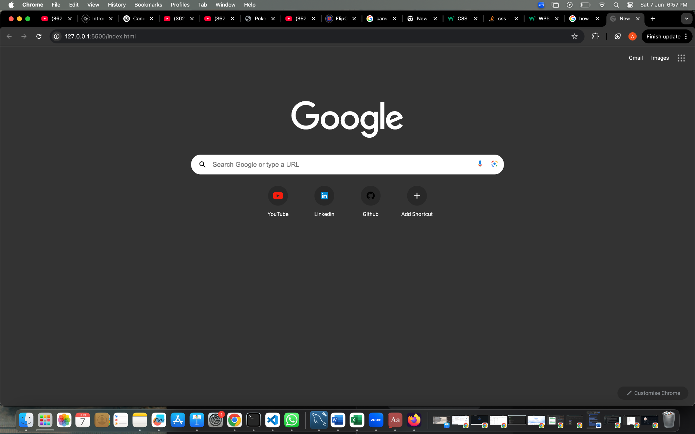

# 🌐 Google Chrome Homepage Clone

This is a clean and responsive **replica of the Google Chrome new tab page**, recreated using only **HTML** and **CSS**. It mimics the dark mode interface of Chrome, complete with search bar, Google branding, and shortcut icons.

---

## 📸 Preview



> *Actual screenshot of the project running in browser.*

---

## 🗂️ File Structure

```
📁 chrome-homepage-clone/
├── 📁 icons/              # All icon assets (YouTube, LinkedIn, mic, etc.)
├── 📁 web/                # Additional web icons
├── 🖼️ google_logo.svg     # Google logo SVG
├── 📄 index.html          # Main HTML file
├── 🎨 styles.css          # Styling with dark mode theme
└── 📄 README.md           # Project description and instructions
```

---

## ⚙️ Features

- ✅ Google logo in center
- ✅ Fully styled search bar (non-functional)
- ✅ Dark mode interface
- ✅ Shortcut icons (YouTube, LinkedIn, GitHub, Add Shortcut)
- ✅ Icon-only UI using locally stored assets
- ✅ Responsive layout with Flexbox

---

## 🚀 How to Run

1. Clone the repository:
   ```bash
   git clone https://github.com/yourusername/chrome-homepage-clone.git
   cd chrome-homepage-clone
   ```

2. Open `index.html` in your browser:
   - Double-click `index.html`, or
   - Use Live Server extension in VS Code

3. *(Optional)* Set as Chrome new tab page:
   - Use the [New Tab Redirect](https://chrome.google.com/webstore/detail/new-tab-redirect/icpgjfneehieebagbmdbhnlpiopdcmna) extension
   - Enter path to `index.html`

---

## 🛠 Built With

- **HTML5**
- **CSS3** – Layout via Flexbox

---

## 🧠 Ideas to Extend

- Add JavaScript to make search bar functional (e.g., Google search redirect)
- Show live time and greeting message
- Allow dynamic shortcut editing

---

## 📄 License

This project is licensed under the [MIT License](LICENSE).

---

## 🙌 Acknowledgements

- Google Logo & layout inspired by Google Chrome
- Icons sourced from [Icons8](https://icons8.com) and Google Material Icons
